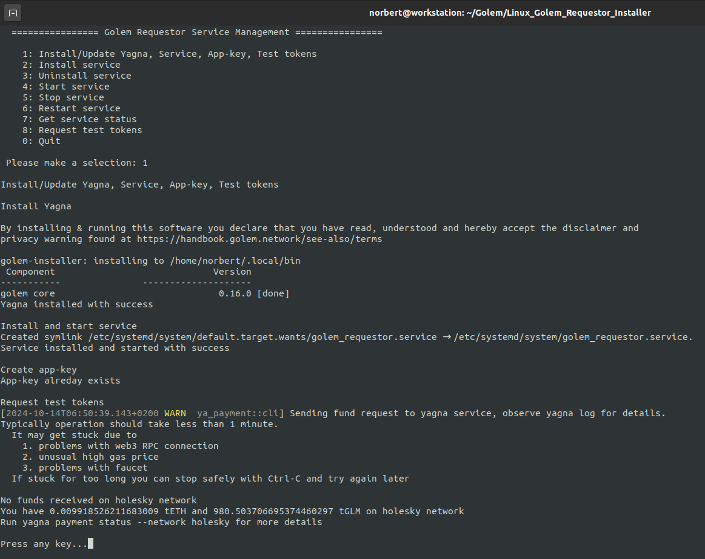

<h1 align="center"> Golem Requestor - Linux Installer </h1>

## Why this installer?
I wrote this installer to make it easier to install/update & manage the Golem Requestor daemon for Linux.  
Indeed, initially, you have to:
- Download the latest Yagna binaries in the Golem repository.
- Add the path to the Path environment variable.
- Create the app-key.
- Request test tokens.  

In addition, you need to first launch the daemon in a dedicated window before running your application. 
Systemd is used to wrap Yagna daemon as a Linux service.

**Thus, this tool makes it possible to automate the installation of the daemon.**  
**Once installed, no need to worry about the daemon anymore, it is launched automatically, just start your application.**  
  
## How to use:  
- Download ZIP archive and extract (or clone) this repository somewhere on your system.  
- Launch install_grs.sh script.
- Launch GolemRequestorService.
- Select option 1.
  
Additional actions are available to manage the service.  
To update Yagna just relaunch GolemRequestorService and select option 1 as for initial installation.  
  

 

